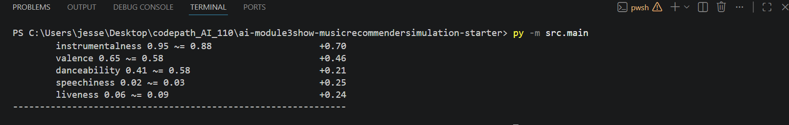
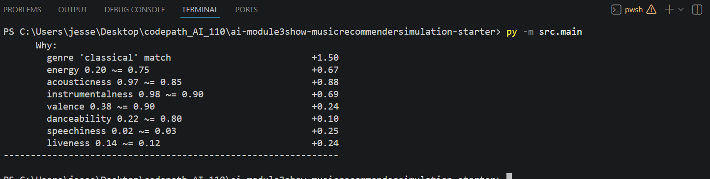

# 🎵 Music Recommender Simulation

## Project Summary

In this project you will build and explain a small music recommender system.

Your goal is to:

- Represent songs and a user "taste profile" as data
- Design a scoring rule that turns that data into recommendations
- Evaluate what your system gets right and wrong
- Reflect on how this mirrors real world AI recommenders

This version builds a content-based music recommender over a 20-song catalog spanning 15 genres and 14 moods. It scores every song against a user taste profile using a weighted combination of categorical matching (mood, genre) and numeric proximity scoring across seven audio features (energy, acousticness, instrumentalness, valence, danceability, speechiness, liveness). The default profile models a "late-night study session" persona. Songs are ranked by total score and the top K results are returned with plain-language explanations.

---

## How The System Works

### Song Features

Each song in `data/songs.csv` carries 13 fields. The first five are descriptive labels; the remaining eight are numeric values on a 0–1 scale (except `tempo_bpm`):

| Field | Type | What it captures |
|---|---|---|
| `id`, `title`, `artist` | metadata | identity only — not used in scoring |
| `genre` | categorical | musical style/tradition (lofi, rock, jazz, k-pop, …) |
| `mood` | categorical | experiential label (focused, intense, romantic, sad, …) |
| `energy` | 0–1 | perceived intensity — 0.28 (ambient) to 0.97 (metal) |
| `tempo_bpm` | float | beats per minute — normalized internally before scoring |
| `valence` | 0–1 | emotional positivity — low = melancholic, high = euphoric |
| `danceability` | 0–1 | groove and rhythmic suitability for movement |
| `acousticness` | 0–1 | organic/unplugged feel vs. electronic production |
| `instrumentalness` | 0–1 | fraction of track without vocals |
| `speechiness` | 0–1 | density of spoken word or rap |
| `liveness` | 0–1 | probability of a live-audience/performance feel |

### User Profile

A `UserProfile` stores two categorical anchors and numeric targets for each scored feature:

- **`favorite_genre`** and **`favorite_mood`** — binary match against each song
- **`target_energy`**, **`target_acousticness`**, **`target_instrumentalness`**, **`target_valence`**, **`target_danceability`**, **`target_speechiness`**, **`target_liveness`** — the "ideal" value the user wants; songs are scored by how close they land

The default profile in `src/main.py` models a **"late-night study session"** persona: low energy, mostly instrumental, warm acoustic texture, no lyrics or crowd noise.

### Algorithm Recipe

Every song in the catalog is scored independently, then the list is sorted and the top K are returned. The score for one song is the sum of two parts:

**Part 1 — Categorical matching (binary: full points or zero)**

```
+2.0  if song.mood  == user.favorite_mood
+1.5  if song.genre == user.favorite_genre
```

Mood outweighs genre because listener intent ("I need something calm") is a stronger signal than style tradition ("I usually like jazz"). Two cross-genre songs sharing the same mood serve the same moment better than two same-genre songs with opposite moods.

**Part 2 — Numeric proximity scoring**

For each numeric feature, the contribution is `weight × (1.0 − |song_value − user_target|)`. A perfect match earns the full weight; a maximum-distance mismatch earns zero.

```
energy           × 1.50   — strongest single discriminator in the catalog
acousticness     × 1.00   — texture dimension, independent of energy
instrumentalness × 0.75   — critical for focus/study use cases
valence          × 0.50   — emotional positivity axis
danceability     × 0.25   — situational (workout, party)
speechiness      × 0.25   — identifies rap/narration tracks
liveness         × 0.25   — studio vs. live feel (tiebreaker)
```

**Maximum possible score: 8.0**

**Part 3 — Ranking**

All 20 scored songs are sorted descending by total score. The top K (default 5) are returned, each with a human-readable explanation of the top contributing reasons.

### Potential Biases

- **Mood-mismatch blind spot.** The mood field is a binary match — a song labeled `chill` scores zero on a `focused` preference even if it would serve the listener just as well. Songs that are experientially close but use a different mood label are unfairly penalized. A partial-match table (e.g. `focused ↔ chill = 0.6 credit`) would reduce this.

- **Catalog concentration.** Ten of the twenty songs are from just three genres (lofi, pop, rock). Users whose taste aligns with those genres get richer, better-differentiated results than users preferring blues, classical, or reggae — which each have only one representative.

- **Numeric features assume linearity.** The proximity formula treats distance as uniform across the whole scale. In practice, the difference between energy 0.30 and 0.35 may feel larger to a listener than the difference between 0.80 and 0.85. A Gaussian decay curve would weight close misses more harshly, but adds complexity.

- **No diversity enforcement.** Because the ranker is a pure sort, the top 5 results can all be from the same genre if that genre scores consistently well. A real system would enforce result variety.

---

## Sample Output

The terminal output below shows the recommender running against the **"Late-Night Study Session"** profile (`genre: lofi`, `mood: focused`). Each result displays the song title, artist, genre, mood, a score out of 8.00, an ASCII progress bar, and a per-feature breakdown of points earned.



---

## Getting Started

### Setup

1. Create a virtual environment (optional but recommended):

   ```bash
   python -m venv .venv
   source .venv/bin/activate      # Mac or Linux
   .venv\Scripts\activate         # Windows

2. Install dependencies

```bash
pip install -r requirements.txt
```

3. Run the app:

```bash
python -m src.main
```

### Running Tests

Run the starter tests with:

```bash
pytest
```

You can add more tests in `tests/test_recommender.py`.

---

## Experiments You Tried

### Adversarial Profile Testing — Preference Dictionary Evaluation

Four "adversarial" user profiles were designed to expose edge cases in the scoring logic. The screenshot below captures the **Impossible Combo** profile (`genre: classical`, `mood: euphoric`) — a combination that no song in the catalog satisfies simultaneously. It shows the per-feature point breakdown for the highest-scoring classical song (*Nocturne in Blue*), which earned the genre match bonus (`+1.50`) but missed on mood, energy, and valence.



**What the four profiles revealed:**

- **Sad Gym Rat** (`mood: sad`, `target_energy: 0.93`) — categorical bonuses (`+3.50` total) overpowered a large energy mismatch. The blues song won even though its energy was `0.38` vs. the target `0.93`.
- **Genre Ghost** (`genre: bossa nova`) — the genre bonus silently dropped to zero for every song. The max achievable score fell to `6.50` with no warning to the user.
- **The Centrist** (all targets at `0.5`, no genre/mood) — all scores clustered between `3.82` and `3.90`. The ranking became nearly arbitrary, decided by fractions of a point on energy proximity.
- **Impossible Combo** (`genre: classical`, `mood: euphoric`) — mood match (`+2.00`) beat genre match (`+1.50`), so EDM ranked above classical. Confirmed that the `mood > genre` weight ordering has real consequences for users with strong genre identity.

---

## Limitations and Risks

Summarize some limitations of your recommender.

Examples:

- It only works on a tiny catalog
- It does not understand lyrics or language
- It might over favor one genre or mood

You will go deeper on this in your model card.

---

## Reflection

Read and complete `model_card.md`:

[**Model Card**](model_card.md)

Write 1 to 2 paragraphs here about what you learned:

- about how recommenders turn data into predictions
- about where bias or unfairness could show up in systems like this


---

## 7. `model_card_template.md`

Combines reflection and model card framing from the Module 3 guidance. :contentReference[oaicite:2]{index=2}  

```markdown
# 🎧 Model Card - Music Recommender Simulation

## 1. Model Name

Give your recommender a name, for example:

> VibeFinder 1.0

---

## 2. Intended Use

- What is this system trying to do
- Who is it for

Example:

> This model suggests 3 to 5 songs from a small catalog based on a user's preferred genre, mood, and energy level. It is for classroom exploration only, not for real users.

---

## 3. How It Works (Short Explanation)

Describe your scoring logic in plain language.

- What features of each song does it consider
- What information about the user does it use
- How does it turn those into a number

Try to avoid code in this section, treat it like an explanation to a non programmer.

---

## 4. Data

Describe your dataset.

- How many songs are in `data/songs.csv`
- Did you add or remove any songs
- What kinds of genres or moods are represented
- Whose taste does this data mostly reflect

---

## 5. Strengths

Where does your recommender work well

You can think about:
- Situations where the top results "felt right"
- Particular user profiles it served well
- Simplicity or transparency benefits

---

## 6. Limitations and Bias

Where does your recommender struggle

Some prompts:
- Does it ignore some genres or moods
- Does it treat all users as if they have the same taste shape
- Is it biased toward high energy or one genre by default
- How could this be unfair if used in a real product

---

## 7. Evaluation

How did you check your system

Examples:
- You tried multiple user profiles and wrote down whether the results matched your expectations
- You compared your simulation to what a real app like Spotify or YouTube tends to recommend
- You wrote tests for your scoring logic

You do not need a numeric metric, but if you used one, explain what it measures.

---

## 8. Future Work

If you had more time, how would you improve this recommender

Examples:

- Add support for multiple users and "group vibe" recommendations
- Balance diversity of songs instead of always picking the closest match
- Use more features, like tempo ranges or lyric themes

---

## 9. Personal Reflection

A few sentences about what you learned:

- What surprised you about how your system behaved
- How did building this change how you think about real music recommenders
- Where do you think human judgment still matters, even if the model seems "smart"

